# Top 20 Git Commands 

### In this repository, I will talk about the top 20 Git commands that you will use frequently when working with Git.
- ```git config```
- ```git init```
- ```git clone```
- ```git add```
- ```git commit```
- ```git diff```
- ```git reset```
- ```git status```
- ```git rm```
- ```git log```
- ```git show```
- ```git tag```
- ```git branch```
- ```git checkout```
- ```git merge```
- ```git remote```
- ```git push```
- ```git pull```
- ```git stash```

## git config
Usage: ```git config –global user.name “[name]” ```<br>
Usage: ```git config –global user.email “[email address]” ```<br>
This command sets the author name and email address respectively to be used with your commits.<br><br>
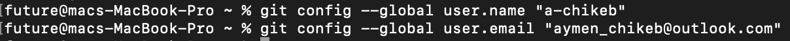
<hr>

## git init <br>
Usage: ```git init [repository name]” ``` <br>
This command is used to start a new repository.<br><br>
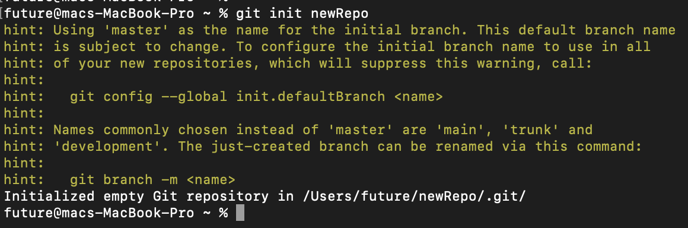
<hr>

## git clone <br>
Usage: ```git clone [url] ``` <br>
This command is used to obtain a repository from an existing URL.<br><br>
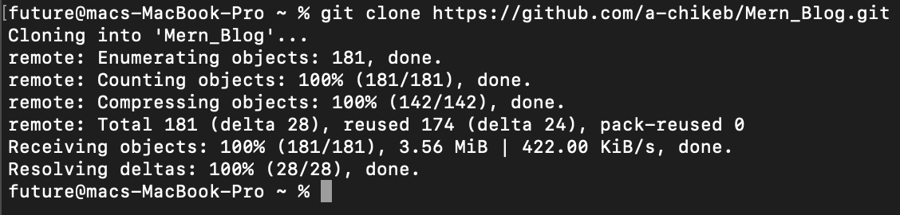
<hr>

## git add <br>
Usage: ```git add [file] ``` <br>
This command adds a file to the staging area.<br><br>
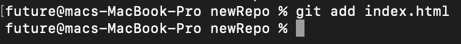<br>
Usage: ```git add *” ``` <br>
This command adds one or more to the staging area.<br><br>

<hr>

## git commit <br>
Usage: ```git commit -m “[ Type in the commit message]” ``` <br>
This command records or snapshots the file permanently in the version history.<br><br>
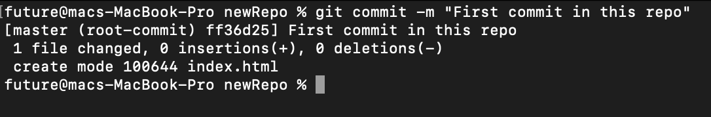<br>
Usage: ```git commit -a” ``` <br>
This command commits any files you’ve added with the git add command and also commits any files you’ve changed since then.<br><br>
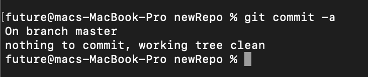
<hr>

## git diff <br>
Usage: ```git diff``` <br>
This command shows the file differences which are not yet staged.<br>
Usage: ```git diff staged” ``` <br>
This command shows the differences between the files in the staging area and the latest version present<br>
Usage: ```git diff [first branch] [second branch] ``` <br>
This command shows the differences between the two branches mentioned.<br><br>
<hr>

## git reset <br>
Usage: ```git reset [file]``` <br>
This command unstages the file, but it preserves the file contents.<br><br>
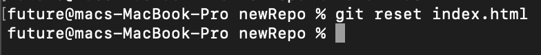<br>
Usage: ```git reset [commit]” ``` <br>
This command undoes all the commits after the specified commit and preserves the changes locally.<br><br>
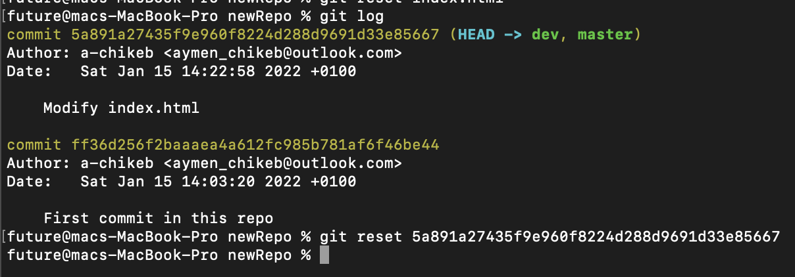<br>
Usage: ```git reset -hard [commit]” ``` <br>
This command discards all history and goes back to the specified commit.<br><br>
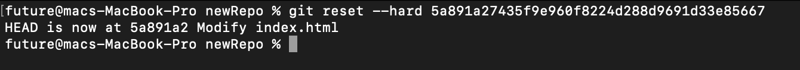<br>
<hr>

## git status <br>
Usage: ```git status [file]``` <br>
This command lists all the files that have to be committed.<br><br>
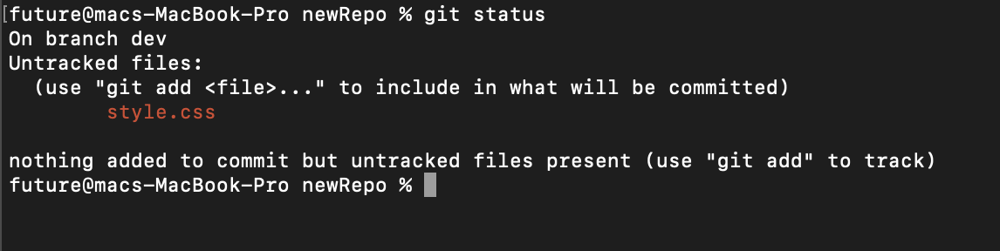<br>
<hr>

## git rm <br>
Usage: ```git rem [file] ``` <br>
This command deletes the file from your working directory and stages the deletion.<br><br>
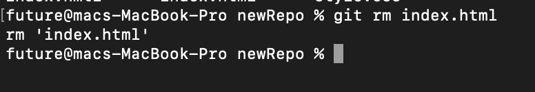
<hr>

## git log <br>
Usage: ```git log``` <br>
This command is used to list the version history for the current branch.<br><br>
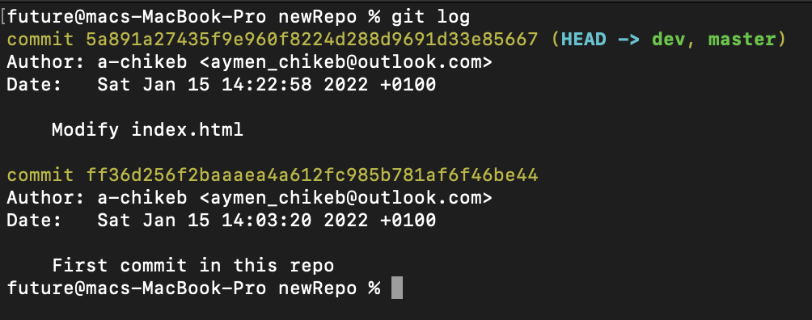
Usage: ```git log –follow[file]``` <br>
This command lists version history for a file, including the renaming of files also.<br><br>
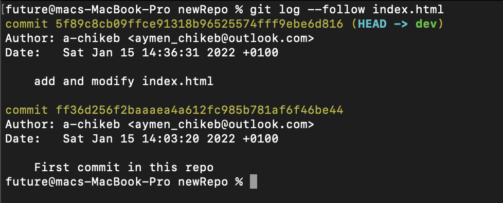
<hr>

## git show <br>
Usage: ```git show``` <br>
This command shows the metadata and content changes of the specified commit.<br><br>
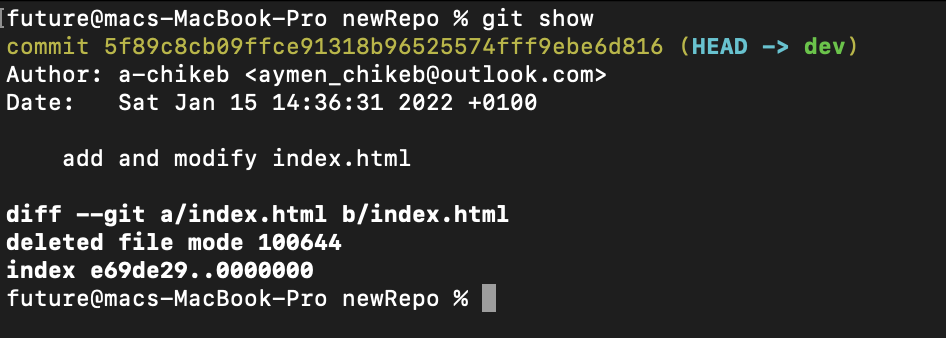
<hr>

## git show <br>
Usage: ```git tag [commitID]``` <br>
This command is used to give tags to the specified commit.<br><br>
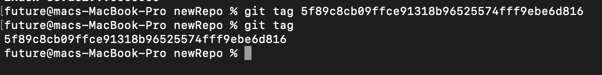
<hr>

## git branch <br>
Usage: ```git branch``` <br>
This command is used to give tags to the specified commit.<br><br>
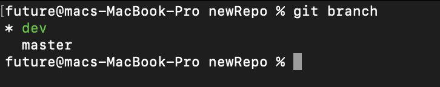<br>
Usage: ```git branch [branch name]``` <br>
This command is used to give tags to the specified commit.<br><br>

Usage: ```git branch -d [branch name]``` <br>
TThis command deletes the feature branch.(you must merge branch)<br><br>
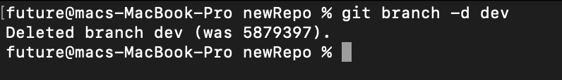
<hr>

## git checkout <br>
Usage: ```git checkout [branch name] ``` <br>
This command is used to switch from one branch to another.<br><br>
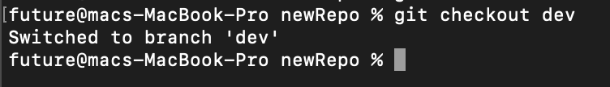<br>
Usage: ```git branch -b [branch name]``` <br>
This command creates a new branch and also switches to it.<br><br>
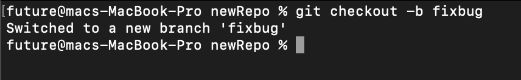
<hr>

## git merge <br>
Usage: ```git merge [branch name]``` <br>
This command merges the specified branch’s history into the current branch.<br><br>
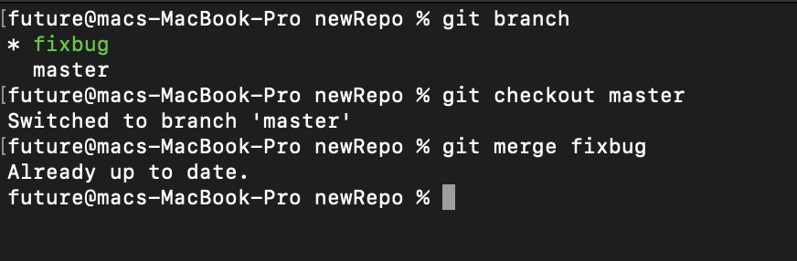<br>
<hr>

## git remote <br>
Usage: ```git remote add [variable name] [Remote Server Link]``` <br>
This command is used to connect your local repository to the remote server.<br><br>
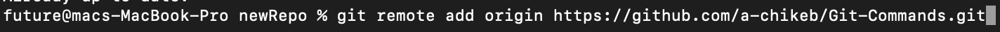<br>
<hr>

## git push <br>
Usage: ```git push [variable name] master``` <br>
This command sends the committed changes of master branch to your remote repository.<br><br>
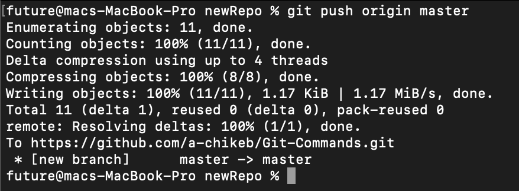<br>

Usage: ```git push [variable name] [branch]``` <br>
This command sends the branch commits to your remote repository.<br><br>
<br>

Usage: ```git push –all [variable name]``` <br>
This command pushes all branches to your remote repository.<br><br>

Usage: ```git push [variable name] :[branch name]``` <br>
This command pushes all branches to your remote repository.<br><br>
<hr>

## git pull <br>
Usage: ```git pull [Repository Link]``` <br>
This command fetches and merges changes on the remote server to your working directory.<br><br>
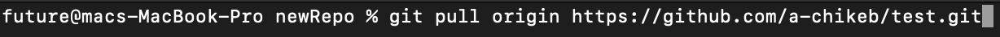<br>
<hr>

## git stash <br>
Usage: ```git stash save``` <br>
This command temporarily stores all the modified tracked files.<br>
Usage: ```git stash pop``` <br>
This command restores the most recently stashed files.<br>
Usage: ```git stash list``` <br>
This command lists all stashed changesets<br>
Usage: ```git stash drop``` <br>
This command lists all stashed changesets<br>


